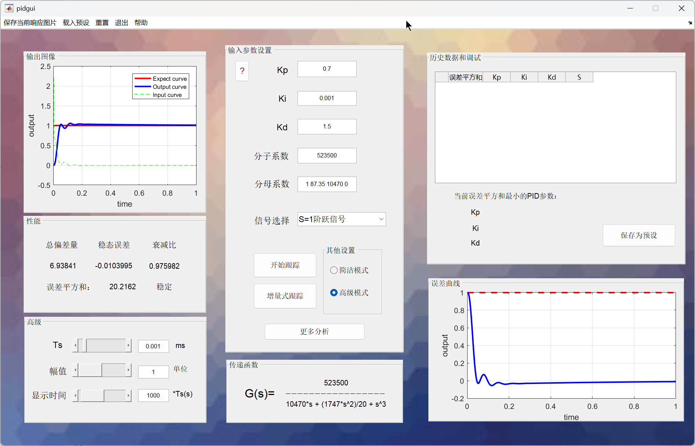
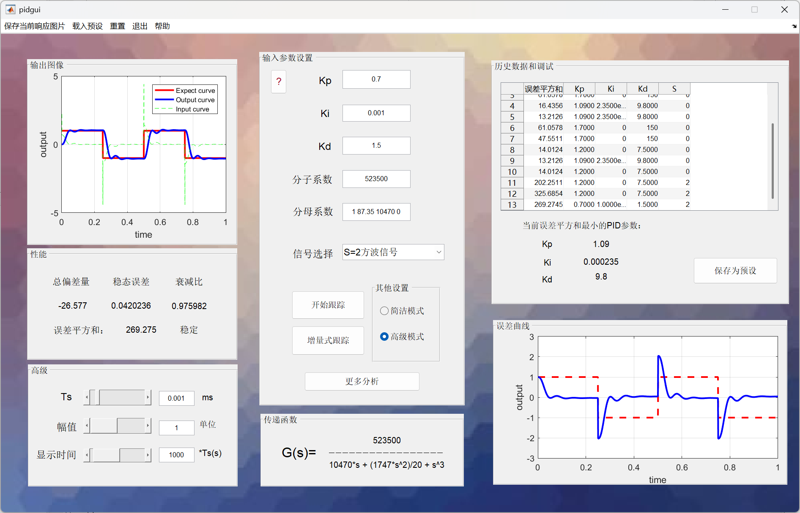
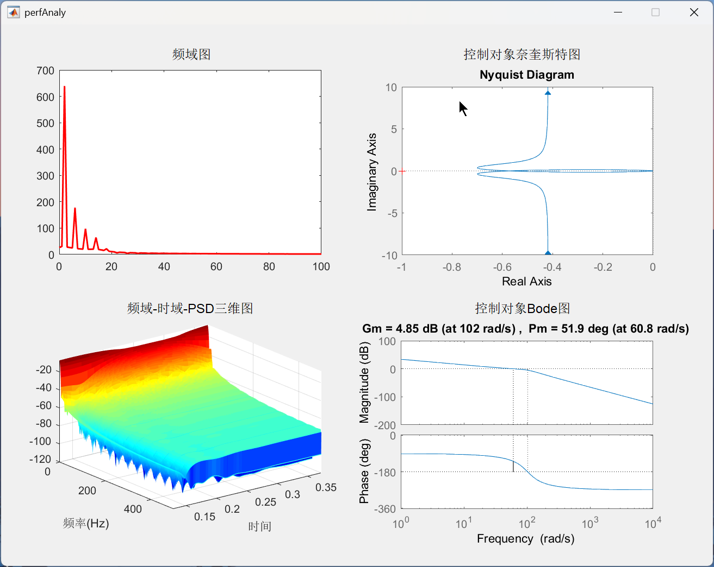

# pidtool-matlab-gui

这是一个写于2019年的MATLAB GUI本科课设项目，写法不成熟，只实现功能，现存档。
程序提供自定义输入PID参数、控制对象传递函数，并跟踪分析不同输入（阶跃、方波、正弦）下的系统响应曲线。

---


---


---



## 实现功能
### 简洁模式
- 本程序可以通过输入PID参数、控制对象传函跟踪不同输入（阶跃、方波、正弦）系统响应
- 本程序支持任意阶数系统的跟踪
- 本程序能够通过误差平方和来显示系统性能
- 输入PID参数的格式为：（整数）
- 输入传递函数分子分母的格式为：（数值）（空格）（数值）...
- 三种输入信号可以在参数输入里进行选择
- 参数输入完成后，点击开始分析进行跟踪
- 右键相响应图片可以对其进行放大、保存和重置
- 放大图片后会弹出新的GUI窗口，三条曲线可以复选显示
- 菜单栏可以保存当前的响应图像
- 菜单栏可以对当前界面以及数据进行重置包括图片、历史数据、输入参数等
- 菜单栏可以将已经预设的参数（PID、控制对象传递函数）导入
- 菜单栏预设还提供一键测试，能够方便的进行测试
- 菜单栏提供退出键
- 更多分析会弹出新的图像窗口，能够输出系统的频域图、时频域3D图；控制对象的奈奎斯特曲线、Bode图

### 高级模式
- 高级模式可以改变采样时间、输入信号幅值、以及显示的时间（通过改变采样次数）
- 高级模式可以查看历史数据、方便地进行调试PID参数以及观测误差曲线
- 高级模式可以使用增量式PID算法进行跟踪
- 历史记录可以记录系统的误差平方和、PID参数、输入信号等信息
- 调试信息会显示当前历史记录中误差平方和最小的对应PID参数
- 在调试信息的基础之上，可以对最右的PID参数进行保存（根据输入信号不同，导入到不同的预设中去）
- 保存后的PID参数可以在菜单栏预设中进行调用
- 误差曲线能够显示当前系统的误差趋势

## 运行方法
已测试环境：MATLAB R2016b
1. 打开MATLAB进入到项目文件夹根目录；
2. MATLAB命令行执行:
```matlab
GUIDE
```
2. 选择并打开现有GUI：pidgui.fig；
3. 菜单选择RUN执行GUI程序，开始使用。
